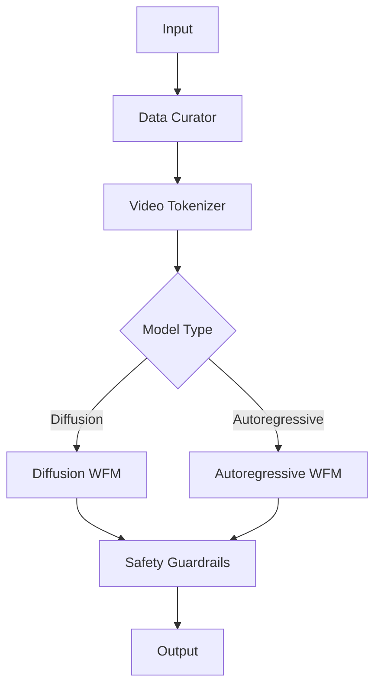

# Cosmos World Foundation Model Platform

[](https://github.com/cosmos-wfm/cosmos/actions)
[](LICENSE)
[](https://www.python.org/downloads/)
[](https://developer.nvidia.com/cuda-downloads)
[](https://docs.cosmos-wfm.ai)

## Introduction

The Cosmos World Foundation Model (WFM) Platform is a comprehensive synthetic data generation system designed to accelerate the development of Physical AI applications. By providing pre-trained foundation models, efficient tokenizers, and a robust data curation pipeline, Cosmos enables developers to generate diverse, physically-accurate synthetic data at scale while significantly reducing the time and cost associated with real-world data collection.

## Features

### Core Components
- **Data Curation Pipeline**
  - Automated video quality assessment
  - Content filtering and deduplication
  - Efficient data storage and retrieval
  - Real-time metadata extraction

- **Video Tokenizers**
  - Continuous tokenization for diffusion models
  - Discrete tokenization for autoregressive models
  - Multiple compression ratios (256:1 to 2048:1)
  - Hardware-accelerated processing

- **Foundation Models**
  - Diffusion WFM (7B-14B parameters)
  - Autoregressive WFM (4B-13B parameters)
  - Pre-trained and domain-adapted variants
  - Distributed training support

- **Safety Guardrails**
  - Pre-Guard for input filtering
  - Post-Guard for output safety
  - Automatic face blurring
  - Content monitoring system

### Key Capabilities
- Text-to-video generation with physical consistency
- Video-to-video generation with trajectory control
- Multi-view video generation with camera pose control
- Action-based control for dynamic scenes
- Distributed training across GPU clusters
- Seamless cloud platform integration

## Prerequisites

- Python 3.10+ with ML framework dependencies
- NVIDIA CUDA 12.0+ with cuDNN 8.0+
- NVIDIA GPU: H100 (recommended) or A100 with 80GB+ VRAM
- Docker 24.0+ and Docker Compose v2.0+
- MongoDB 6.0+ for metadata storage
- Redis 7.0+ for caching
- Minimum 1TB NVMe storage
- 100Gbps networking (recommended)

## Quick Start

1. Clone the repository:
```bash
git clone https://github.com/cosmos-wfm/cosmos.git
cd cosmos
```

2. Start the platform using Docker Compose:
```bash
docker compose up -d
```

3. Generate your first synthetic video:
```bash
cosmos generate --prompt "A robot picking up a cup from a table" \
                --duration 5 \
                --resolution 1280x720 \
                --model diffusion-7b
```

## Installation

### Docker Deployment

```yaml
version: '3.8'
services:
  cosmos:
    image: cosmos-wfm/platform:latest
    runtime: nvidia
    environment:
      - NVIDIA_VISIBLE_DEVICES=all
    ports:
      - "8000:8000"
    volumes:
      - data:/data
      - models:/models
```

### Cloud Deployment

Supported platforms:
- AWS (EC2 p4d.24xlarge instances)
- Google Cloud (A2-ultragpu-8g instances)
- Azure (NC H100 v4 instances)

Refer to [cloud deployment guide](docs/deployment/cloud.md) for detailed instructions.

### On-Premises Setup

For air-gapped environments, follow our [on-premises installation guide](docs/deployment/on-premises.md).

## Architecture



## Usage Guide

### API Reference

```python
from cosmos import Client

client = Client(api_key="your-api-key")
video = client.generate(
    prompt="A robot navigating through a warehouse",
    duration=10,
    resolution=(1280, 720),
    model="diffusion-7b"
)
```

### CLI Guide

```bash
# Train a custom model
cosmos train --dataset /path/to/data \
             --model diffusion-7b \
             --epochs 100 \
             --batch-size 32

# Generate video
cosmos generate --prompt "input prompt" \
                --output video.mp4
```

### Web Dashboard

Access the monitoring dashboard at `http://localhost:8000/dashboard`

## Performance

| Model | Resolution | Generation Time | GPU Memory |
|-------|------------|----------------|------------|
| Diffusion-7B | 720p | ~380s | 74.0 GB |
| Diffusion-14B | 720p | ~590s | 70.5 GB |
| Autoregressive-4B | 720p | ~62s | 31.3 GB |
| Autoregressive-12B | 720p | ~119s | 47.5 GB |

## Security

- Role-based access control (RBAC)
- API key authentication
- Input content filtering
- Output safety verification
- Automatic PII protection
- Audit logging

## Troubleshooting

Common issues and solutions are documented in our [troubleshooting guide](docs/troubleshooting.md).

## Contributing

Please read our [Contributing Guidelines](CONTRIBUTING.md) for details on our code of conduct and development process.

## License

This project is licensed under the Apache License 2.0 - see the [LICENSE](LICENSE) file for details.

## Citation

```bibtex
@software{cosmos_wfm_2024,
  title={Cosmos World Foundation Model Platform},
  author={Cosmos WFM Team},
  year={2024},
  url={https://github.com/cosmos-wfm/cosmos}
}
```