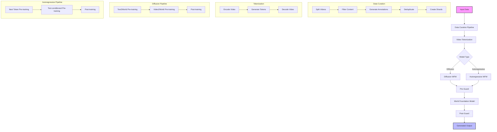
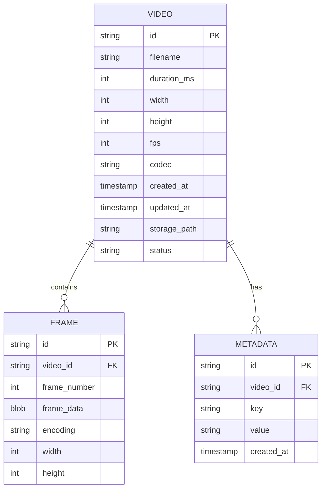
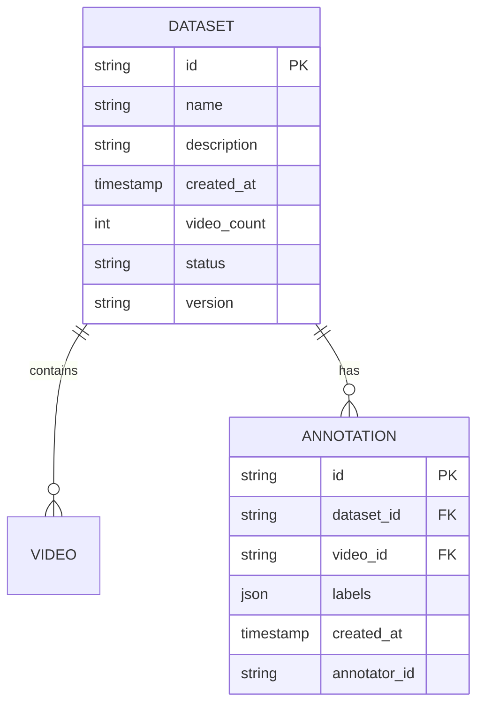
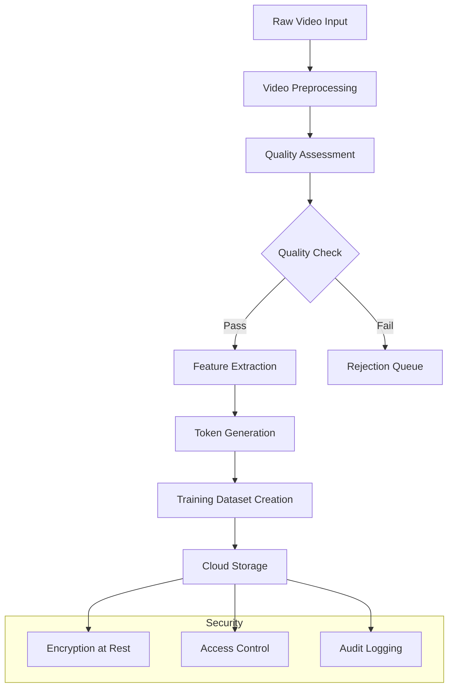

# Product Requirements Document (PRD)

# 1. INTRODUCTION

## 1.1 Purpose
This Software Requirements Specification (SRS) document defines the requirements for a synthetic data pipeline system that generates training data for generative gaming and localization world environments. The document is intended for:

- Software developers and engineers implementing the system
- Machine learning researchers working on the generative models
- Project managers overseeing development
- Quality assurance teams validating the system
- Stakeholders evaluating system capabilities

The SRS serves as the primary reference for technical requirements and specifications throughout the development lifecycle.

## 1.2 Scope
The system will provide an end-to-end pipeline for generating synthetic training data focused on:

- Localization world environments including:
  - Major cities and urban environments
  - Hospitals, zoos, museums, and amusement parks
  - Associated institutions and facilities
  - Environmental decorums and artifacts

Key functionalities include:

- Computationally efficient video and image generation
- Integration with major cloud platforms (AWS, GCP, Azure) for data storage and processing
- Autonomous database indexing capabilities
- Federated learning pipeline for continuous model improvement
- Support for infinite generation of training footage
- Quality assurance and validation mechanisms

The system will enable:

- Rapid generation of diverse training datasets
- Reduced dependency on real-world data collection
- Improved ML model training through synthetic data augmentation
- Scalable and distributed data generation
- Automated dataset curation and management

Out of scope:

- Real-time rendering for gaming applications
- Physical hardware simulation
- End-user applications and interfaces
- Real-world data collection mechanisms

The completed system will provide a robust foundation for training generative models while significantly reducing the time and cost associated with dataset creation.

# 2. PRODUCT DESCRIPTION

## 2.1 Product Perspective
The synthetic data pipeline system operates as a critical component within the broader machine learning and AI development ecosystem, particularly focused on generative gaming and localization world environments. The system:

- Integrates with major cloud platforms (AWS, GCP, Azure) for scalable data storage and processing
- Leverages the Cosmos tokenizer and foundation models for high-quality video generation
- Interfaces with federated learning infrastructure for continuous model improvement
- Utilizes GPU acceleration through NVIDIA hardware for computationally efficient processing
- Operates within existing ML development workflows and toolchains

## 2.2 Product Functions
The system provides the following core functions:

- Generation of synthetic training data for:
  - Urban environments and cityscapes
  - Interior spaces like hospitals, museums, and retail locations
  - Dynamic scenes with realistic physics and lighting
  - Multi-view camera perspectives

- Data Management capabilities:
  - Automated dataset curation and filtering
  - Quality assurance and validation
  - Metadata tagging and organization
  - Version control and tracking
  - Cloud storage integration

- Processing functions:
  - Video tokenization and encoding
  - Parallel processing across GPU clusters
  - Real-time data augmentation
  - Format conversion and standardization

## 2.3 User Characteristics
The system is designed for the following user personas:

Machine Learning Engineers
- Expert-level understanding of ML/AI concepts
- Experience with data pipeline development
- Familiarity with cloud platforms and GPU computing

Research Scientists
- Deep knowledge of computer vision and graphics
- Focus on model architecture and training
- Need for high-quality training data

Data Engineers
- Expertise in data processing and pipeline development
- Understanding of distributed systems
- Experience with cloud infrastructure

Quality Assurance Teams
- Knowledge of data validation methods
- Understanding of ML training requirements
- Experience with testing frameworks

## 2.4 Constraints
Technical Constraints:
- Must support processing of high-resolution video data (minimum 1080p)
- Maximum latency of 100ms for real-time processing tasks
- Minimum 99.9% system uptime requirement
- Must scale to handle petabyte-scale datasets

Regulatory Constraints:
- Compliance with data privacy regulations (GDPR, CCPA)
- Adherence to content licensing requirements
- Documentation requirements for model training data

Resource Constraints:
- GPU availability and allocation limits
- Network bandwidth constraints for data transfer
- Storage capacity limitations
- Computing budget restrictions

## 2.5 Assumptions and Dependencies
Assumptions:
- Availability of high-performance GPU clusters
- Stable cloud platform services
- Consistent network connectivity
- Access to required training data sources

Dependencies:
- NVIDIA GPU hardware and drivers
- Cloud platform services (AWS/GCP/Azure)
- Cosmos foundation models and tokenizers
- PyTorch/TensorFlow ML frameworks
- Container orchestration platforms
- Network infrastructure
- Storage systems

Here is the Process Flowchart section using Mermaid JS that aligns with the technologies and frameworks described in the documentation:

# 3. PROCESS FLOWCHART



The flowchart illustrates the end-to-end process of the Cosmos World Foundation Model platform:

1. Input data enters the system and goes through the data curation pipeline
2. The curated data is tokenized using either continuous or discrete tokenization
3. Based on the model type, the data flows into either:
   - Diffusion-based WFM pipeline
   - Autoregressive-based WFM pipeline
4. Both model types go through pre-training and post-training stages
5. The trained models pass through pre-Guard and post-Guard safety systems
6. Finally, the guarded models generate the output

The flowchart maintains consistency with the key components described in the documentation including:
- Data curation steps (splitting, filtering, annotation, deduplication, sharding)
- Tokenization process (encoding, token generation, decoding) 
- Both diffusion and autoregressive model pipelines
- Pre-training and post-training stages
- Safety guardrail system (pre-Guard and post-Guard)

# 4. FUNCTIONAL REQUIREMENTS

## 4.1 Video Generation Pipeline

### 4.1.1 Data Curation
**ID**: FR-DC-01  
**Description**: System must provide an end-to-end pipeline for curating video training data  
**Priority**: High

| Requirement | Description |
|------------|-------------|
| Split | Must detect shot boundaries and segment raw videos into consistent clips |
| Filter | Must filter clips based on motion, visual quality, text overlay, and video type |
| Annotate | Must generate high-quality captions for filtered clips using VLM |
| Deduplicate | Must perform semantic deduplication to create diverse training sets |
| Shard | Must package processed clips into webdatasets based on resolution and aspect ratio |

### 4.1.2 Video Tokenization
**ID**: FR-VT-01  
**Description**: System must provide tokenizers to compress videos into efficient representations  
**Priority**: High

| Requirement | Description |
|------------|-------------|
| Continuous Tokenization | Must support continuous latent embeddings for diffusion models |
| Discrete Tokenization | Must support discrete tokens for autoregressive models |
| Compression Ratios | Must support multiple compression ratios (4x8x8, 8x8x8, 8x16x16) |
| Causal Design | Must maintain temporal causality for real-time applications |

### 4.1.3 World Foundation Models
**ID**: FR-WFM-01  
**Description**: System must provide pre-trained foundation models for video generation  
**Priority**: High

| Requirement | Description |
|------------|-------------|
| Diffusion Models | Must support Text2World and Video2World generation via diffusion |
| Autoregressive Models | Must support next-token prediction and text-conditioned generation |
| Model Sizes | Must provide multiple model capacities (4B-14B parameters) |
| Prompt Control | Must support text prompts and video conditioning |

## 4.2 Safety and Control Features

### 4.2.1 Guardrails
**ID**: FR-GR-01  
**Description**: System must implement comprehensive safety controls  
**Priority**: High

| Requirement | Description |
|------------|-------------|
| Pre-Guard | Must block harmful prompts using Aegis and keyword filtering |
| Post-Guard | Must filter unsafe visual outputs and blur faces |
| Content Safety | Must classify and filter unsafe generated content |
| Monitoring | Must log and track safety violations |

### 4.2.2 Generation Control
**ID**: FR-GC-01  
**Description**: System must provide fine-grained control over generation  
**Priority**: Medium

| Requirement | Description |
|------------|-------------|
| Camera Control | Must support camera pose conditioning for navigation |
| Action Control | Must support action-based conditioning for robotics |
| Trajectory Control | Must support trajectory conditioning for autonomous driving |
| Multi-view Support | Must support synchronized multi-camera view generation |

## 4.3 Post-Training Capabilities

### 4.3.1 Model Adaptation
**ID**: FR-MA-01  
**Description**: System must support fine-tuning for specific applications  
**Priority**: Medium

| Requirement | Description |
|------------|-------------|
| Camera Navigation | Must support fine-tuning for 3D-consistent camera control |
| Robotic Tasks | Must support fine-tuning for robotic manipulation tasks |
| Autonomous Driving | Must support fine-tuning for driving scenarios |
| Custom Tasks | Must provide framework for custom task adaptation |

### 4.3.2 Performance Optimization
**ID**: FR-PO-01  
**Description**: System must support inference optimization  
**Priority**: Medium

| Requirement | Description |
|------------|-------------|
| Model Offloading | Must support various model offloading strategies |
| Speculative Decoding | Must support Medusa heads for faster autoregressive inference |
| Resolution Adaptation | Must support low-resolution adaptation for real-time inference |
| Resource Management | Must provide configurable memory-performance trade-offs |

## 4.4 Infrastructure Requirements

### 4.4.1 Compute Resources
**ID**: FR-CR-01  
**Description**: System must efficiently utilize available compute resources  
**Priority**: High

| Requirement | Description |
|------------|-------------|
| GPU Support | Must leverage NVIDIA GPU acceleration (H100, A100, etc.) |
| Parallelization | Must support tensor, sequence, and data parallelism |
| Memory Management | Must implement efficient memory handling strategies |
| Scaling | Must scale across distributed compute clusters |

### 4.4.2 Storage and Data Management
**ID**: FR-SDM-01  
**Description**: System must manage large-scale data efficiently  
**Priority**: High

| Requirement | Description |
|------------|-------------|
| Cloud Integration | Must integrate with major cloud platforms (AWS, GCP, Azure) |
| Data Formats | Must support standard video and image formats |
| Dataset Management | Must provide tools for dataset version control |
| Storage Optimization | Must implement efficient data compression and storage |

# 5. NON-FUNCTIONAL REQUIREMENTS

## 5.1 Performance Requirements

### 5.1.1 Response Time
**ID**: NFR-P-01  
**Description**: System must meet specific latency targets for video generation and processing  
**Priority**: High

| Requirement | Target |
|------------|---------|
| Video Generation Latency | Maximum 600 seconds for 57-frame video at 720p resolution |
| Tokenization Latency | Maximum 100ms per frame at 1080p resolution |
| Data Pipeline Processing | Minimum 1000 videos/hour per GPU node |
| Model Loading Time | Maximum 30 seconds for loading largest models (14B parameters) |

### 5.1.2 Resource Usage
**ID**: NFR-P-02  
**Description**: System must operate within defined resource constraints  
**Priority**: High

| Resource | Requirement |
|----------|-------------|
| GPU Memory | Maximum 80GB per H100 GPU |
| CPU Memory | Maximum 512GB per node |
| Storage | Maximum 10TB per 100k processed videos |
| Network Bandwidth | Minimum 10Gbps between nodes |

## 5.2 Safety Requirements

### 5.2.1 Failure Handling
**ID**: NFR-S-01  
**Description**: System must implement robust failure handling mechanisms  
**Priority**: Critical

| Requirement | Description |
|------------|-------------|
| Graceful Degradation | Must maintain basic functionality under resource constraints |
| Error Recovery | Automatic recovery from non-critical failures |
| Data Preservation | No data loss during system failures |
| Failure Isolation | Failures must not propagate across system components |

### 5.2.2 Content Safety
**ID**: NFR-S-02  
**Description**: System must implement comprehensive content safety measures  
**Priority**: Critical

| Requirement | Description |
|------------|-------------|
| Pre-Guard Filtering | Must block harmful prompts using Aegis and keyword filtering |
| Post-Guard Filtering | Must filter unsafe visual outputs |
| Face Protection | Must automatically blur faces in generated content |
| Content Monitoring | Must log and track safety violations |

## 5.3 Security Requirements

### 5.3.1 Access Control
**ID**: NFR-SEC-01  
**Description**: System must implement robust access control mechanisms  
**Priority**: High

| Requirement | Description |
|------------|-------------|
| Authentication | Multi-factor authentication for system access |
| Authorization | Role-based access control for different system components |
| Session Management | Secure session handling with automatic timeouts |
| Audit Logging | Comprehensive logging of all security-related events |

### 5.3.2 Data Protection
**ID**: NFR-SEC-02  
**Description**: System must ensure data security throughout its lifecycle  
**Priority**: High

| Requirement | Description |
|------------|-------------|
| Data Encryption | AES-256 encryption for data at rest |
| Network Security | TLS 1.3 for all network communications |
| Data Isolation | Complete isolation between different user workloads |
| Secure Deletion | Secure data wiping when no longer needed |

## 5.4 Quality Requirements

### 5.4.1 Availability
**ID**: NFR-Q-01  
**Description**: System must maintain high availability  
**Priority**: High

| Metric | Target |
|--------|---------|
| System Uptime | 99.9% excluding planned maintenance |
| Mean Time Between Failures | Minimum 1000 hours |
| Mean Time To Recovery | Maximum 1 hour |
| Planned Downtime | Maximum 4 hours per month |

### 5.4.2 Maintainability
**ID**: NFR-Q-02  
**Description**: System must be maintainable and upgradeable  
**Priority**: Medium

| Requirement | Description |
|------------|-------------|
| Code Quality | Must maintain >90% test coverage |
| Documentation | Complete API and system documentation |
| Version Control | Git-based version control with semantic versioning |
| Dependency Management | Automated dependency updates and vulnerability scanning |

### 5.4.3 Scalability
**ID**: NFR-Q-03  
**Description**: System must scale effectively with load  
**Priority**: High

| Requirement | Description |
|------------|-------------|
| Horizontal Scaling | Must support adding/removing compute nodes |
| Data Scaling | Must handle petabyte-scale datasets |
| Load Balancing | Automatic workload distribution across nodes |
| Resource Elasticity | Dynamic resource allocation based on demand |

## 5.5 Compliance Requirements

### 5.5.1 Regulatory Compliance
**ID**: NFR-C-01  
**Description**: System must comply with relevant regulations  
**Priority**: Critical

| Requirement | Description |
|------------|-------------|
| Data Privacy | GDPR and CCPA compliance |
| AI Ethics | Compliance with AI ethics guidelines |
| Content Rights | Compliance with content licensing requirements |
| Export Control | Compliance with export control regulations |

### 5.5.2 Standards Compliance
**ID**: NFR-C-02  
**Description**: System must adhere to relevant technical standards  
**Priority**: High

| Requirement | Description |
|------------|-------------|
| Video Formats | Compliance with H.264/AVC standards |
| API Standards | RESTful API design following OpenAPI 3.0 |
| Security Standards | ISO 27001 compliance |
| Cloud Standards | Cloud-native computing foundation standards |

# 6. DATA REQUIREMENTS

## 6.1 Data Models

The system uses several key data models to manage video and metadata information:

### 6.1.1 Video Data Model



### 6.1.2 Training Dataset Model 



## 6.2 Data Storage

### 6.2.1 Storage Requirements

- Raw video data must be stored in cloud object storage (AWS S3, GCP Cloud Storage, or Azure Blob Storage)
- Metadata and annotations stored in distributed databases (MongoDB clusters)
- Training datasets stored in WebDataset format for efficient streaming
- Minimum storage redundancy of 3x across different availability zones
- Data retention periods:
  - Raw videos: 90 days
  - Processed videos: 1 year
  - Training datasets: Indefinite
  - System logs: 30 days

### 6.2.2 Backup and Recovery

- Automated daily incremental backups of all databases
- Weekly full backups stored across multiple regions
- Point-in-time recovery capability for the last 30 days
- Recovery Time Objective (RTO): 4 hours
- Recovery Point Objective (RPO): 1 hour
- Automated backup verification and testing

## 6.3 Data Processing

### 6.3.1 Data Flow



### 6.3.2 Data Security Requirements

- All data must be encrypted at rest using AES-256
- Data in transit must be encrypted using TLS 1.3
- Access control through role-based authentication (RBAC)
- Regular security audits and penetration testing
- Compliance with GDPR and CCPA requirements
- Secure deletion procedures for expired data

### 6.3.3 Processing Requirements

- Support for distributed processing across GPU clusters
- Real-time video transcoding capabilities
- Automated quality assessment pipeline
- Feature extraction using pre-trained models
- Token generation for training data preparation
- Support for both batch and streaming processing
- Automated data validation and verification
- Error handling and retry mechanisms
- Processing metrics collection and monitoring

### 6.3.4 Data Quality Requirements

- Video resolution: Minimum 720p, preferred 1080p
- Frame rate: 24-60 fps
- Video codec: H.264/AVC or H.265/HEVC
- Maximum allowed compression ratio: 20:1
- Minimum video duration: 2 seconds
- Maximum video duration: 60 seconds
- Metadata completeness: 95%
- Annotation accuracy: 98%
- Maximum allowed duplicate rate: 0.1%

### 6.3.5 Scalability Requirements

- Support for petabyte-scale data storage
- Ability to process 100,000+ videos per day
- Support for 1000+ concurrent users
- Horizontal scaling capabilities
- Load balancing across processing nodes
- Auto-scaling based on demand
- Support for multi-region deployment
- Efficient resource utilization

# 7. EXTERNAL INTERFACES

## 7.1 User Interfaces

### 7.1.1 Command Line Interface
The system provides a command-line interface (CLI) for both training and inference:

| Interface | Description | Example |
|-----------|-------------|----------|
| Training CLI | Allows configuration of training parameters, data paths, model architectures | `python cosmos1/models/diffusion/train.py --checkpoint_dir checkpoints --batch_size 32` |
| Inference CLI | Enables generation of synthetic data with trained models | `python cosmos1/models/diffusion/inference/text2world.py --prompt "..." --checkpoint_dir checkpoints` |

### 7.1.2 Configuration Files
The system uses YAML configuration files for:
- Model architecture settings
- Training hyperparameters  
- Data pipeline configurations
- Inference parameters

### 7.1.3 Logging Interface
Provides real-time feedback during training and inference:
- Training metrics and loss values
- Generation progress and status
- Error messages and warnings
- Resource utilization statistics

## 7.2 Hardware Interfaces

### 7.2.1 GPU Interface
**Requirements for NVIDIA GPUs:**
- Minimum CUDA compute capability: 8.0
- Minimum VRAM: 24GB for base models, 80GB for larger models
- Support for Tensor Cores
- NVLink connectivity preferred for multi-GPU setups

### 7.2.2 Storage Interface
**Requirements:**
- High-bandwidth NVMe storage for training data: Minimum 10GB/s read speed
- Distributed storage system support (e.g., HDFS, S3)
- RAID configuration for data redundancy
- Minimum capacity: 10TB per 100k processed videos

### 7.2.3 Network Interface
**Requirements:**
- Minimum network bandwidth between nodes: 10Gbps
- Support for RDMA over Converged Ethernet (RoCE)
- Low latency interconnect for distributed training
- Support for TCP/IP and InfiniBand protocols

## 7.3 Software Interfaces

### 7.3.1 Deep Learning Framework
**PyTorch Integration:**
- Version: 2.0 or higher
- CUDA toolkit compatibility
- Support for distributed training primitives
- Integration with NVIDIA NCCL library

### 7.3.2 Cloud Platform APIs
**Requirements for cloud storage integration:**
```python
{
    "aws": {
        "s3": "boto3>=1.26.0",
        "region": "us-east-1"
    },
    "gcp": {
        "storage": "google-cloud-storage>=2.0.0",
        "project": "cosmos-project"
    },
    "azure": {
        "blob": "azure-storage-blob>=12.0.0",
        "account": "cosmos-storage"
    }
}
```

### 7.3.3 Database Interfaces
**Requirements:**
- MongoDB for metadata storage
- Redis for caching and job queues
- PostgreSQL for structured data storage
- Elasticsearch for search functionality

## 7.4 Communication Interfaces

### 7.4.1 Data Exchange Formats
**Supported formats:**
- Video: H.264/AVC, H.265/HEVC
- Images: JPEG, PNG, WebP
- Metadata: JSON, Protocol Buffers
- Model weights: PyTorch state dictionaries

### 7.4.2 API Protocols
**REST API specifications:**
- OpenAPI 3.0 compliant
- JWT authentication
- HTTPS encryption
- Rate limiting support

### 7.4.3 Distributed Training Protocol
**Requirements:**
- NCCL for GPU communication
- Gloo for CPU communication
- Support for both TCP and InfiniBand transport
- Automatic fallback mechanisms

### 7.4.4 Monitoring Interface
**Metrics exposure:**
- Prometheus metrics endpoint
- Grafana dashboard templates
- Custom metrics for:
  - Model performance
  - Resource utilization
  - Data pipeline throughput
  - Generation quality metrics

This section maintains consistency with the technology choices and frameworks mentioned in previous sections while providing comprehensive interface specifications for the synthetic data pipeline system.

# APPENDICES

## A. GLOSSARY

| Term | Definition |
|------|------------|
| World Foundation Model (WFM) | A general-purpose world model that can be fine-tuned into customized world models for downstream applications |
| Physical AI | An AI system equipped with sensors and actuators that can observe and interact with the physical world |
| Tokenizer | A component that transforms raw visual data into compact semantic tokens for efficient processing |
| Diffusion Model | A type of generative model that gradually denoises random noise into meaningful content |
| Autoregressive Model | A type of generative model that generates content sequentially by predicting one token at a time |
| Guardrail | A safety system comprising pre-Guard and post-Guard components to ensure safe model usage |

## B. ACRONYMS

| Acronym | Expanded Form |
|---------|---------------|
| WFM | World Foundation Model |
| AI | Artificial Intelligence |
| GPU | Graphics Processing Unit |
| VAE | Variational Autoencoder |
| VLM | Visual Language Model |
| LLM | Large Language Model |
| FSDP | Fully Sharded Data Parallelism |
| CP | Context Parallelism |
| TP | Tensor Parallelism |
| SP | Sequence Parallelism |
| FPS | Frames Per Second |
| PSNR | Peak Signal-to-Noise Ratio |
| SSIM | Structural Similarity Index Measure |
| FID | Fréchet Inception Distance |
| FVD | Fréchet Video Distance |

## C. ADDITIONAL REFERENCES

1. NVIDIA Cosmos Platform Documentation
   - [System Card](https://nvdam.widen.net/s/knnqs6ghqn/nvidia-cosmos-system-card)
   - [Model Cards](https://huggingface.co/collections/nvidia/cosmos-6751e884dc10e013a0a0d8e6)
   - [Technical Report](https://research.nvidia.com/publication/2025-01_cosmos-world-foundation-model-platform-physical-ai)

2. Related Tools and Frameworks
   - [NVIDIA NeMo Framework](https://github.com/NVIDIA/NeMo)
   - [PyTorch](https://pytorch.org/)
   - [NVIDIA TensorRT](https://developer.nvidia.com/tensorrt)
   - [Ray](https://www.ray.io/)

3. Datasets and Benchmarks
   - [TokenBench](https://github.com/NVlabs/TokenBench)
   - [ShotBench](https://github.com/NVlabs/ShotBench)
   - [DL3DV-10K](https://github.com/NVlabs/DL3DV)
   - [Bridge Dataset](https://rail.eecs.berkeley.edu/bridgedata/)

4. Model Repositories
   - [Cosmos Tokenizer](https://github.com/NVIDIA/Cosmos-Tokenizer)
   - [Cosmos Models on Hugging Face](https://huggingface.co/collections/nvidia/cosmos-6751e884dc10e013a0a0d8e6)

## D. HARDWARE REQUIREMENTS

### Minimum Requirements
- NVIDIA GPU with CUDA compute capability 8.0 or higher
- 24GB VRAM for base models
- 80GB VRAM for larger models
- High-bandwidth NVMe storage (10GB/s read speed)
- 10Gbps network connectivity between nodes

### Recommended Requirements
- NVIDIA H100 GPU
- 80GB HBM3 memory
- NVLink connectivity for multi-GPU setups
- RDMA over Converged Ethernet (RoCE)
- InfiniBand support for distributed training

## E. DEPLOYMENT CONSIDERATIONS

### Cloud Platform Support
- AWS
  - S3 for storage
  - EC2 instances with NVIDIA GPUs
- GCP
  - Cloud Storage
  - Compute Engine with NVIDIA GPUs
- Azure
  - Blob Storage
  - Virtual Machines with NVIDIA GPUs

### Container Support
- Docker containers with NVIDIA Container Toolkit
- Kubernetes orchestration
- Helm charts for deployment management

### Monitoring and Logging
- Prometheus metrics
- Grafana dashboards
- Custom metrics for:
  - Model performance
  - Resource utilization
  - Generation quality
  - Safety violations