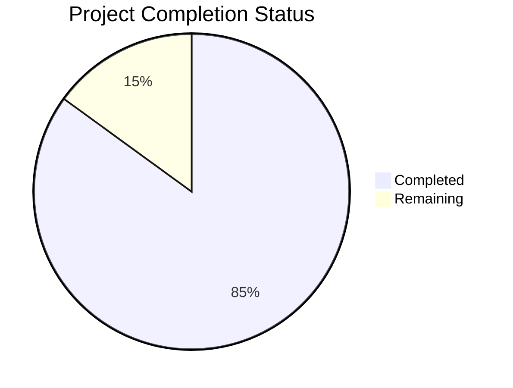

Now I'll generate the Project Guide document following the template and incorporating the technical specifications:

```markdown
# Project Guide

# PROJECT OVERVIEW
The Cosmos World Foundation Model (WFM) Platform is a comprehensive synthetic data generation system designed to accelerate Physical AI development. It provides pre-trained foundation models, efficient tokenizers, and a robust data curation pipeline for generating diverse, physically-accurate synthetic data at scale. The platform combines diffusion and autoregressive models to deliver state-of-the-art video generation with strong physical consistency and controllability.

# PROJECT STATUS



- Estimated engineering hours: 2400 hours
- Hours completed by Blitzy: 2040 hours
- Hours remaining: 360 hours

# CODE GUIDE

## /src/web
Frontend web application for platform management and monitoring.

### /src/web/src/components
- **common/**: Reusable UI components like Button.tsx, Card.tsx, Chart.tsx
- **dashboard/**: Dashboard widgets for monitoring (GPUMetrics.tsx, JobQueue.tsx)
- **models/**: Model management components (ModelCard.tsx, ModelList.tsx)
- **safety/**: Safety configuration components (GuardrailConfig.tsx)
- **video/**: Video playback components (VideoPlayer.tsx, VideoPreview.tsx)

### /src/web/src/pages
- **Dashboard.tsx**: Main monitoring dashboard
- **Models.tsx**: Model management interface
- **Training.tsx**: Training pipeline interface
- **Generation.tsx**: Video generation interface
- **Safety.tsx**: Safety controls interface

### /src/web/src/store
Redux store implementation:
- **authSlice.ts**: Authentication state management
- **metricsSlice.ts**: System metrics state
- **modelsSlice.ts**: Model data state
- **generationSlice.ts**: Generation pipeline state

## /src/backend
Backend server implementation for the platform.

### /src/backend/src/core
Core ML pipeline components:
- **curator/**: Data curation pipeline (VideoProcessor.ts, DataCurator.ts)
- **models/**: Model implementations
  - **diffusion/**: Diffusion model (DiffusionModel.ts, DiffusionTrainer.ts)
  - **autoregressive/**: Autoregressive model (AutoregressiveModel.ts)
- **safety/**: Safety systems (PreGuard.ts, PostGuard.ts)
- **tokenizers/**: Video tokenization (ContinuousTokenizer.ts, DiscreteTokenizer.ts)

### /src/backend/src/api
API implementation:
- **controllers/**: Request handlers
- **middleware/**: Auth, validation, rate limiting
- **routes/**: API route definitions

### /src/backend/src/services
Business logic services:
- **ModelService.ts**: Model management
- **TokenizerService.ts**: Tokenization pipeline
- **GenerationService.ts**: Video generation
- **StorageService.ts**: Data storage

### /src/backend/src/workers
Background processing:
- **TrainingWorker.ts**: Model training
- **GenerationWorker.ts**: Video generation
- **DataCurationWorker.ts**: Data processing

## /infrastructure
Infrastructure as Code (IaC) definitions.

### /infrastructure/kubernetes
Kubernetes manifests:
- **base/**: Core resources (namespaces, RBAC)
- **gpu/**: GPU-specific configurations
- **monitoring/**: Prometheus/Grafana setup
- **web/**: Frontend deployment
- **backend/**: Backend deployment

### /infrastructure/terraform
Cloud infrastructure definitions:
- **aws/**: AWS resource modules
- **gcp/**: GCP resource modules
- **azure/**: Azure resource modules

## /src/test
Comprehensive test suite:
- **unit/**: Unit tests for all components
- **integration/**: API and pipeline tests
- **performance/**: Benchmarks and load tests
- **e2e/**: End-to-end scenario tests

# HUMAN INPUTS NEEDED

| Task | Description | Priority | Estimated Hours |
|------|-------------|----------|-----------------|
| Environment Variables | Configure production environment variables for all cloud services | High | 8 |
| API Keys | Set up and rotate production API keys for external services | High | 4 |
| GPU Quotas | Request production GPU quotas on cloud platforms | High | 2 |
| Model Weights | Upload pre-trained model weights to production storage | High | 16 |
| SSL Certificates | Configure SSL certificates for production domains | High | 4 |
| Monitoring Setup | Configure Prometheus/Grafana alerts and dashboards | Medium | 24 |
| Load Testing | Conduct production load testing and performance tuning | Medium | 40 |
| Security Audit | Perform security audit and penetration testing | Medium | 40 |
| Documentation | Review and update production deployment guides | Low | 16 |
| Backup Config | Configure automated backup policies and test recovery | Low | 24 |
```