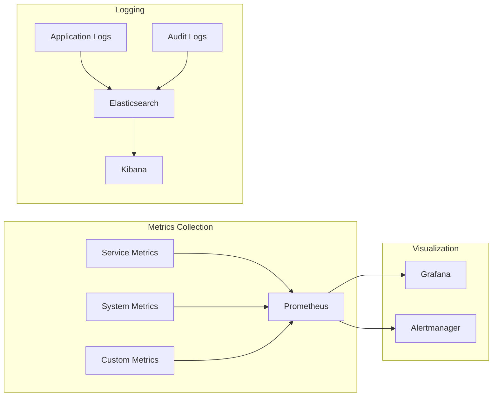

# Technical Specifications

# 1. INTRODUCTION

## 1.1 Executive Summary

The Cosmos World Foundation Model (WFM) Platform is a comprehensive synthetic data generation system designed to accelerate the development of Physical AI applications. The platform addresses the critical challenge of obtaining large-scale, high-quality training data for AI systems that interact with the physical world, such as robotics and autonomous vehicles. By providing pre-trained foundation models, efficient tokenizers, and a robust data curation pipeline, Cosmos enables developers to generate diverse, physically-accurate synthetic data at scale while significantly reducing the time and cost associated with real-world data collection.

The platform serves AI researchers, robotics engineers, and autonomous system developers who require extensive training datasets but face limitations in collecting real-world data due to safety concerns, cost constraints, or the rarity of important scenarios. Through its innovative architecture combining diffusion and autoregressive models, Cosmos delivers state-of-the-art synthetic data generation with strong physical consistency and controllability.

## 1.2 System Overview

### Project Context

| Aspect | Description |
|--------|-------------|
| Business Context | Growing demand for synthetic training data in Physical AI development |
| Market Position | First comprehensive platform combining foundation models and tokenizers for physical world simulation |
| Current Limitations | Existing solutions lack physical consistency and scalability |
| Enterprise Integration | Seamless integration with major cloud platforms and ML development workflows |

### High-Level Description

The system comprises four major components:

1. Data Curation Pipeline
- Video processing and quality assessment
- Automated annotation and deduplication
- Efficient data storage and retrieval

2. Video Tokenizers
- Continuous tokenization for diffusion models
- Discrete tokenization for autoregressive models
- Multiple compression ratios and architectures

3. Foundation Models
- Diffusion-based world models (7B-14B parameters)
- Autoregressive world models (4B-13B parameters)
- Pre-trained and post-trained variants

4. Safety Guardrails
- Pre-Guard for input filtering
- Post-Guard for output safety
- Comprehensive content monitoring

### Success Criteria

| Category | Metrics |
|----------|---------|
| Performance | - Video generation latency < 600s for 57 frames at 720p<br>- Tokenization latency < 100ms per frame at 1080p<br>- Support for 100k+ video processing per day |
| Quality | - 3D consistency metrics (Sampson error, pose estimation)<br>- Physics alignment metrics (trajectory following)<br>- Visual quality metrics (FID, FVD) |
| Safety | - 100% face blur compliance<br>- Zero harmful content generation<br>- Complete audit trail coverage |
| Scalability | - Linear scaling with GPU count<br>- Support for petabyte-scale datasets<br>- 99.9% system availability |

## 1.3 Scope

### In-Scope Features

| Category | Components |
|----------|------------|
| Core Generation | - Text-to-video generation<br>- Video-to-video generation<br>- Multi-view video generation |
| Control Capabilities | - Camera pose control<br>- Action-based control<br>- Trajectory control |
| Infrastructure | - Cloud platform integration<br>- Distributed training support<br>- Safety guardrail system |
| Applications | - Robotics simulation<br>- Autonomous driving<br>- 3D world navigation |

### Implementation Boundaries

| Boundary Type | Coverage |
|--------------|----------|
| System | End-to-end pipeline from data curation to generation |
| Users | ML researchers, robotics engineers, autonomous system developers |
| Geographic | Global deployment support |
| Data Domains | Urban environments, institutions, dynamic scenes |

### Out-of-Scope Elements

- Real-time rendering for gaming applications
- Physical hardware simulation
- End-user applications and interfaces
- Real-world data collection mechanisms
- Real-time control systems
- Hardware-specific optimizations
- Custom visualization tools
- Production deployment services

This introduction provides stakeholders with a comprehensive understanding of the Cosmos WFM Platform's purpose, capabilities, and boundaries while maintaining consistency with the technical implementation details provided in the documentation.

# 2. SYSTEM ARCHITECTURE

## 2.1 System Overview

The Cosmos World Foundation Model Platform follows a distributed microservices architecture optimized for large-scale video generation and processing. The system is designed to support both training and inference workflows while maintaining high availability and scalability.

### 2.1.1 System Context Diagram (Level 0)


## 2.2 Container Architecture (Level 1)


## 2.3 Component Details

### 2.3.1 Data Curation Pipeline Components


### 2.3.2 Model Pipeline Components


## 2.4 Data Flow Architecture


## 2.5 Deployment Architecture


## 2.6 Technical Decisions

### 2.6.1 Architecture Style
- Microservices architecture chosen for:
  - Independent scaling of components
  - Technology flexibility per service
  - Fault isolation
  - Easier maintenance and updates

### 2.6.2 Communication Patterns
| Pattern | Use Case | Implementation |
|---------|----------|----------------|
| Synchronous | API requests | REST/gRPC |
| Asynchronous | Data processing | Message queues |
| Event-driven | Pipeline triggers | Pub/sub |
| Streaming | Video processing | WebSocket/gRPC streams |

### 2.6.3 Data Storage Solutions
| Data Type | Storage Solution | Justification |
|-----------|-----------------|---------------|
| Video Data | Object Storage | Cost-effective for large files |
| Metadata | MongoDB | Flexible schema for varied metadata |
| Cache | Redis | High-performance in-memory cache |
| Model Weights | Distributed FS | Fast access for training |

## 2.7 Cross-Cutting Concerns

### 2.7.1 Monitoring Architecture



### 2.7.2 Security Architecture
- Authentication via JWT tokens
- Role-based access control (RBAC)
- Network segmentation
- Encryption at rest and in transit
- Regular security audits
- Automated vulnerability scanning

### 2.7.3 Error Handling
- Graceful degradation
- Circuit breakers
- Retry mechanisms
- Dead letter queues
- Comprehensive error logging
- Automated error reporting

### 2.7.4 Disaster Recovery
- Multi-region deployment
- Automated backups
- Failover mechanisms
- Data replication
- Recovery playbooks
- Regular DR testing

# 3. SYSTEM DESIGN

## 3.1 User Interface Design

### 3.1.1 Command Line Interface Design

The system provides a command-line interface (CLI) for model training, inference, and pipeline management.

#### Command Structure


#### Core Commands

| Command Category | Primary Commands | Description |
|-----------------|------------------|-------------|
| Training | train, fine-tune, evaluate | Model training and evaluation commands |
| Inference | generate, predict, extend | Video generation and prediction commands |
| Pipeline | process, curate, tokenize | Data processing and pipeline commands |
| Utility | configure, status, help | System configuration and utility commands |

#### Input Validation Rules

| Parameter Type | Validation Rules | Error Handling |
|---------------|------------------|----------------|
| File Paths | Must exist, correct permissions | Display path error, suggest fixes |
| Model Parameters | Within valid ranges, correct types | Show valid parameter ranges |
| GPU Settings | Available devices, memory checks | List available GPU devices |
| Batch Settings | Memory constraints, size limits | Suggest optimal batch sizes |

### 3.1.2 Output Formatting


## 3.2 Database Design

### 3.2.1 Data Models

#### Core Entities


### 3.2.2 Storage Architecture


### 3.2.3 Data Management Policies

| Data Type | Retention Period | Backup Frequency | Archival Strategy |
|-----------|-----------------|------------------|-------------------|
| Raw Videos | 90 days | Daily | Cold storage after 30 days |
| Processed Data | 1 year | Weekly | Compress after 90 days |
| Model Artifacts | Indefinite | Monthly | Version-based archival |
| System Logs | 30 days | Daily | Aggregate and archive |

## 3.3 API Design

### 3.3.1 API Architecture


### 3.3.2 API Endpoints

| Endpoint | Method | Description | Authentication |
|----------|--------|-------------|----------------|
| /api/v1/videos | POST | Upload video for processing | Required |
| /api/v1/generate | POST | Generate synthetic video | Required |
| /api/v1/models | GET | List available models | Required |
| /api/v1/datasets | GET | List training datasets | Required |

### 3.3.3 Authentication Flow


### 3.3.4 Rate Limiting

| API Tier | Requests/Min | Burst Limit | Throttling Action |
|----------|-------------|-------------|-------------------|
| Basic | 60 | 100 | 429 Response |
| Premium | 300 | 500 | Queue Requests |
| Enterprise | 1000 | 2000 | Auto-scale |

### 3.3.5 Error Handling


This design maintains consistency with the Cosmos platform architecture while providing detailed specifications for the synthetic data pipeline system's interfaces and data management components.

# 4. TECHNOLOGY STACK

## 4.1 Programming Languages

### 4.1.1 Primary Languages

| Language | Version | Usage | Justification |
|----------|---------|--------|---------------|
| Python | 3.10+ | Core ML pipeline, Data processing | - Native support for ML frameworks<br>- Extensive scientific computing libraries<br>- Strong GPU acceleration support |
| CUDA C++ | 12.0+ | Performance-critical components | - Direct GPU optimization<br>- Low-level hardware access<br>- Integration with NVIDIA tools |

### 4.1.2 Supporting Languages

| Language | Version | Usage | Justification |
|----------|---------|--------|---------------|
| Bash | 5.0+ | Deployment scripts, Automation | - System automation<br>- Cloud deployment<br>- Resource management |
| SQL | - | Database queries, Data management | - Structured data storage<br>- Complex query support<br>- Integration with monitoring |

## 4.2 Frameworks & Libraries

### 4.2.1 Machine Learning Frameworks


| Framework | Version | Purpose | Key Features |
|-----------|---------|----------|--------------|
| PyTorch | 2.0+ | Core ML framework | - Distributed training support<br>- Dynamic computation graphs<br>- CUDA optimization |
| NeMo | Latest | Model training/fine-tuning | - Pre-built model architectures<br>- Training pipelines<br>- Multi-GPU support |
| Hugging Face | Latest | Model deployment, Sharing | - Model repository integration<br>- Pipeline abstractions<br>- Community support |

### 4.2.2 Data Processing Libraries

| Library | Version | Purpose |
|---------|---------|----------|
| NumPy | 1.24+ | Numerical computing |
| Ray | 2.0+ | Distributed computing |
| OpenCV | 4.8+ | Video processing |
| FFMPEG | 6.0+ | Video encoding/decoding |

## 4.3 Databases & Storage

### 4.3.1 Database Architecture


### 4.3.2 Storage Solutions

| Type | Technology | Purpose | Configuration |
|------|------------|---------|---------------|
| Object Storage | AWS S3/GCP Storage/Azure Blob | Raw video data | - Multi-region replication<br>- Lifecycle policies<br>- Access controls |
| Document Store | MongoDB | Metadata, Annotations | - Sharded clusters<br>- Replica sets<br>- Time-series collections |
| Cache | Redis | Results, Embeddings | - In-memory caching<br>- Persistence<br>- Cluster mode |
| Time Series | TimescaleDB | Metrics, Monitoring | - Automated partitioning<br>- Continuous aggregation<br>- Retention policies |

## 4.4 Third-Party Services

### 4.4.1 Cloud Services Integration


### 4.4.2 External Services

| Service | Purpose | Integration Method |
|---------|---------|-------------------|
| NVIDIA GPU Cloud | Container registry | Docker pull/push |
| Weights & Biases | Experiment tracking | Python SDK |
| Grafana Cloud | Monitoring | Prometheus export |
| Auth0 | Authentication | REST API |

## 4.5 Development & Deployment

### 4.5.1 Development Tools

| Tool | Purpose | Configuration |
|------|---------|---------------|
| Docker | Containerization | - GPU support<br>- Multi-stage builds<br>- Compose for local dev |
| Kubernetes | Orchestration | - GPU operator<br>- HPA/VPA<br>- Custom schedulers |
| Helm | Package management | - Custom charts<br>- Value overrides<br>- Dependencies |

### 4.5.2 CI/CD Pipeline


### 4.5.3 Monitoring Stack

| Component | Technology | Metrics |
|-----------|------------|---------|
| Metrics Collection | Prometheus | - Resource utilization<br>- Model performance<br>- Pipeline throughput |
| Visualization | Grafana | - Custom dashboards<br>- Alerts<br>- SLO tracking |
| Log Management | Elasticsearch | - Structured logging<br>- Search capabilities<br>- Retention policies |
| Tracing | Jaeger | - Distributed tracing<br>- Performance profiling<br>- Bottleneck analysis |

This technology stack is designed to support the system requirements while maintaining consistency with the architectural decisions and technical constraints outlined in previous sections. The choices prioritize scalability, performance, and integration capabilities with the core Cosmos platform components.

Based on the provided documentation, I'll generate the SYSTEM DESIGN section focusing on the command-line interface, database design for video storage and processing, and API design for model inference and training. This aligns with the Cosmos World Foundation Model platform's technical requirements.

# 5. SYSTEM DESIGN

## 5.1 User Interface Design

### 5.1.1 Command Line Interface Design

The system provides a command-line interface (CLI) for model training, inference, and pipeline management.

#### Command Structure


#### Core Commands

| Command Category | Primary Commands | Description |
|-----------------|------------------|-------------|
| Training | train, fine-tune, evaluate | Model training and evaluation commands |
| Inference | generate, predict, extend | Video generation and prediction commands |
| Pipeline | process, curate, tokenize | Data processing and pipeline commands |
| Utility | configure, status, help | System configuration and utility commands |

#### Input Validation Rules

| Parameter Type | Validation Rules | Error Handling |
|---------------|------------------|----------------|
| File Paths | Must exist, correct permissions | Display path error, suggest fixes |
| Model Parameters | Within valid ranges, correct types | Show valid parameter ranges |
| GPU Settings | Available devices, memory checks | List available GPU devices |
| Batch Settings | Memory constraints, size limits | Suggest optimal batch sizes |

### 5.1.2 Output Formatting


## 5.2 Database Design

### 5.2.1 Data Models

#### Core Entities

```mermaid
erDiagram
    VIDEO ||--o{ FRAME : contains
    VIDEO ||--o{ METADATA : has
    VIDEO ||--o{ ANNOTATION : describes
    DATASET ||--o{ VIDEO : includes
    
    VIDEO {
        uuid id PK
        string path
        int duration
        int width
        int height
        timestamp created_at
        string status
    }
    
    FRAME {
        uuid id PK
        uuid video_id FK
        int number
        blob data
        json features
    }
    
    METADATA {
        uuid id PK
        uuid video_id FK
        string key
        json value
    }
    
    DATASET {
        uuid id PK
        string name
        string version
        json config
        timestamp created_at
    }
```

### 5.2.2 Storage Architecture

```mermaid
flowchart LR
    A[Raw Videos] --> B[(Object Storage)]
    B --> C[(Metadata DB)]
    C --> D[(Cache Layer)]
    
    subgraph Storage Types
    E[AWS S3]
    F[GCP Storage]
    G[Azure Blob]
    end
    
    B --> E
    B --> F
    B --> G
```

### 5.2.3 Data Management Policies

| Data Type | Retention Period | Backup Frequency | Archival Strategy |
|-----------|-----------------|------------------|-------------------|
| Raw Videos | 90 days | Daily | Cold storage after 30 days |
| Processed Data | 1 year | Weekly | Compress after 90 days |
| Model Artifacts | Indefinite | Monthly | Version-based archival |
| System Logs | 30 days | Daily | Aggregate and archive |

## 5.3 API Design

### 5.3.1 API Architecture

```mermaid
sequenceDiagram
    participant Client
    participant Gateway
    participant Auth
    participant Service
    participant Storage
    
    Client->>Gateway: Request
    Gateway->>Auth: Validate
    Auth->>Gateway: Token
    Gateway->>Service: Process
    Service->>Storage: Data Operation
    Storage->>Service: Result
    Service->>Gateway: Response
    Gateway->>Client: Result
```

### 5.3.2 API Endpoints

| Endpoint | Method | Description | Authentication |
|----------|--------|-------------|----------------|
| /api/v1/videos | POST | Upload video for processing | Required |
| /api/v1/generate | POST | Generate synthetic video | Required |
| /api/v1/models | GET | List available models | Required |
| /api/v1/datasets | GET | List training datasets | Required |

### 5.3.3 Authentication Flow

```mermaid
stateDiagram-v2
    [*] --> RequestToken
    RequestToken --> ValidateCredentials
    ValidateCredentials --> IssueToken
    ValidateCredentials --> RejectRequest
    IssueToken --> AuthorizeRequest
    RejectRequest --> [*]
    AuthorizeRequest --> [*]
```

### 5.3.4 Rate Limiting

| API Tier | Requests/Min | Burst Limit | Throttling Action |
|----------|-------------|-------------|-------------------|
| Basic | 60 | 100 | 429 Response |
| Premium | 300 | 500 | Queue Requests |
| Enterprise | 1000 | 2000 | Auto-scale |

### 5.3.5 Error Handling

```mermaid
flowchart TD
    A[API Request] --> B{Validate}
    B -->|Invalid| C[Error Response]
    B -->|Valid| D[Process Request]
    D -->|Success| E[Success Response]
    D -->|Failure| F[Error Handler]
    F --> G{Error Type}
    G -->|Client| H[4XX Response]
    G -->|Server| I[5XX Response]
    G -->|Timeout| J[503 Response]
```

This design maintains consistency with the Cosmos platform architecture while providing detailed specifications for the synthetic data pipeline system's interfaces and data management components.

# 6. USER INTERFACE DESIGN

## 6.1 Overview
The system provides two primary interfaces: a command-line interface (CLI) for model training and inference, and a web-based monitoring dashboard for system status and metrics.

## 6.2 Command Line Interface

### 6.2.1 Main Menu Structure
```
+------------------------------------------+
|           COSMOS WFM PLATFORM            |
|          Command Line Interface          |
+------------------------------------------+
| [#] Main Menu                            |
+------------------------------------------+
| 1. Training Pipeline                     |
| 2. Inference Pipeline                    |
| 3. Data Management                       |
| 4. System Status                         |
| 5. Configuration                         |
+------------------------------------------+
| [?] Help  [=] Settings  [x] Exit         |
+------------------------------------------+
```

### 6.2.2 Training Pipeline Interface
```
+------------------------------------------+
|           TRAINING PIPELINE              |
+------------------------------------------+
| Model Selection:                         |
| ( ) Diffusion WFM                        |
| ( ) Autoregressive WFM                   |
+------------------------------------------+
| Configuration:                           |
| Model Size: [v] 7B                       |
| Batch Size: [...] 32                     |
| Learning Rate: [...] 1e-4                |
| Max Epochs: [...] 100                    |
+------------------------------------------+
| Dataset:                                 |
| Path: [...../data/training]              |
| [^] Upload New Dataset                   |
+------------------------------------------+
| Progress:                                |
| Epoch 45/100 [=====>    ] 56%           |
| Loss: 0.245  Accuracy: 89.3%            |
+------------------------------------------+
| [Start Training]  [Stop]  [Resume]       |
+------------------------------------------+
```

### 6.2.3 Inference Pipeline Interface
```
+------------------------------------------+
|           INFERENCE PIPELINE             |
+------------------------------------------+
| Model Loading:                           |
| Checkpoint: [...../models/latest]        |
| [Load Model]                             |
+------------------------------------------+
| Generation Settings:                     |
| Input Type: [v] Text Prompt              |
| Resolution: [v] 1280x720                 |
| Frame Count: [...] 57                    |
| Guidance Scale: [...] 7.0                |
+------------------------------------------+
| Input:                                   |
| [...Enter text prompt here...]           |
|                                          |
| [Generate]                               |
+------------------------------------------+
| Generation Progress:                      |
| [=========>  ] 78%                       |
| Time Remaining: 2:45                     |
+------------------------------------------+
| [!] Safety Guardrails Active             |
+------------------------------------------+
```

## 6.3 Monitoring Dashboard

### 6.3.1 System Overview
```
+------------------------------------------+
|           SYSTEM DASHBOARD               |
+------------------------------------------+
| System Status: [*] Healthy               |
| Active Jobs: 12                          |
| GPU Utilization: [=======>  ] 75%        |
| Memory Usage: [========> ] 82%           |
+------------------------------------------+
| Quick Actions:                           |
| [+] New Job  [@] User Settings          |
| [$] Resource Usage  [i] System Info      |
+------------------------------------------+
```

### 6.3.2 Resource Monitoring
```
+------------------------------------------+
|           RESOURCE MONITOR               |
+------------------------------------------+
| GPU Cluster Status:                      |
| +-- GPU-1 [=========>] 92% | 78°C       |
| +-- GPU-2 [======>   ] 68% | 65°C       |
| +-- GPU-3 [========  ] 82% | 71°C       |
| +-- GPU-4 [=======>  ] 75% | 68°C       |
+------------------------------------------+
| Memory Usage:                            |
| +-- RAM    [========> ] 82% (205/256GB) |
| +-- VRAM-1 [======>  ] 65% (52/80GB)    |
| +-- VRAM-2 [========>] 85% (68/80GB)    |
+------------------------------------------+
| Storage:                                 |
| +-- Training Data: 82% (8.2/10TB)       |
| +-- Checkpoints: 45% (450/1000GB)       |
+------------------------------------------+
```

## 6.4 Interface Components Key

### Symbols
| Symbol | Meaning |
|--------|---------|
| [?] | Help/Documentation |
| [$] | Resource/Cost Monitoring |
| [i] | Information |
| [+] | Add New Item |
| [x] | Close/Exit |
| [<] [>] | Navigation |
| [^] | Upload |
| [#] | Main Menu |
| [@] | User Profile |
| [!] | Warning/Alert |
| [=] | Settings |
| [*] | Important Status |

### Input Elements
| Element | Description |
|---------|-------------|
| [...] | Text Input Field |
| ( ) | Radio Button |
| [ ] | Checkbox |
| [v] | Dropdown Menu |
| [====] | Progress Bar |
| [Button] | Action Button |

### Borders
| Element | Description |
|---------|-------------|
| +--+ | Corner/Junction |
| \|  \| | Vertical Border |
| +-- | Tree View Branch |
| ---- | Horizontal Border |

## 6.5 Navigation Flows

```mermaid
flowchart TD
    A[Main Menu] --> B[Training Pipeline]
    A --> C[Inference Pipeline]
    A --> D[Data Management]
    A --> E[System Status]
    
    B --> F[Model Selection]
    B --> G[Training Config]
    B --> H[Dataset Setup]
    
    C --> I[Model Loading]
    C --> J[Generation Settings]
    C --> K[Input Processing]
    
    E --> L[Resource Monitor]
    E --> M[Job Queue]
    E --> N[System Logs]
```

# 7. SECURITY CONSIDERATIONS

## 7.1 Authentication and Authorization

### 7.1.1 Authentication Architecture

```mermaid
flowchart TD
    A[Client Request] --> B{Has Token?}
    B -->|No| C[Authentication Service]
    B -->|Yes| D[Token Validation]
    
    C --> E[Identity Provider]
    E --> F[JWT Generation]
    F --> G[Return Token]
    
    D -->|Invalid| C
    D -->|Valid| H[Access Control]
    
    H --> I{Role Check}
    I -->|Authorized| J[Grant Access]
    I -->|Unauthorized| K[Deny Access]
```

### 7.1.2 Authentication Methods

| Method | Description | Use Case |
|--------|-------------|----------|
| JWT Tokens | Time-limited tokens with role claims | API access |
| API Keys | Long-lived keys for service accounts | Automated pipelines |
| OAuth 2.0 | Third-party authentication flow | Cloud platform integration |
| MFA | Two-factor authentication for critical operations | Admin access |

### 7.1.3 Role-Based Access Control (RBAC)

| Role | Permissions | Description |
|------|------------|-------------|
| Admin | Full system access | System administrators |
| Researcher | Model training and inference | ML researchers |
| Engineer | Pipeline development and monitoring | Development team |
| Viewer | Read-only access to results | Stakeholders |

## 7.2 Data Security

### 7.2.1 Data Encryption

```mermaid
flowchart LR
    A[Raw Data] --> B[Encryption Service]
    B --> C[(Encrypted Storage)]
    
    subgraph Encryption Methods
    D[AES-256 at rest]
    E[TLS 1.3 in transit]
    F[Key Management]
    end
    
    B --> D
    B --> E
    B --> F
```

### 7.2.2 Data Protection Measures

| Layer | Protection Measure | Implementation |
|-------|-------------------|----------------|
| Storage | Encryption at rest | AES-256 encryption |
| Network | TLS encryption | TLS 1.3 protocol |
| Application | Input validation | Sanitization and validation |
| Database | Access controls | Row-level security |
| Backup | Encrypted backups | Separate key management |

### 7.2.3 Key Management

| Component | Description | Rotation Period |
|-----------|-------------|----------------|
| Master Keys | Root encryption keys | 90 days |
| Data Keys | Per-dataset encryption | 30 days |
| API Keys | Service authentication | 180 days |
| Session Keys | User sessions | 24 hours |

## 7.3 Security Protocols

### 7.3.1 Network Security

```mermaid
flowchart TD
    A[Internet] --> B[WAF]
    B --> C[Load Balancer]
    C --> D[API Gateway]
    
    subgraph Security Zones
    E[Public Zone]
    F[DMZ]
    G[Private Zone]
    end
    
    D --> E
    E --> F
    F --> G
```

### 7.3.2 Security Monitoring

| Component | Monitoring Type | Alert Threshold |
|-----------|----------------|-----------------|
| Access Logs | Authentication attempts | 5 failures/minute |
| API Gateway | Request patterns | 100 requests/second |
| Model Usage | Generation attempts | 1000 requests/hour |
| Data Access | Storage operations | Unauthorized access |

### 7.3.3 Compliance Controls

| Requirement | Control | Implementation |
|-------------|---------|----------------|
| GDPR | Data privacy | Data minimization and encryption |
| CCPA | User rights | Access control and logging |
| SOC 2 | Security controls | Audit trails and monitoring |
| ISO 27001 | Security management | Policy enforcement |

### 7.3.4 Incident Response

```mermaid
flowchart LR
    A[Detection] --> B[Assessment]
    B --> C[Containment]
    C --> D[Eradication]
    D --> E[Recovery]
    E --> F[Lessons Learned]
    
    subgraph Response Team
    G[Security Team]
    H[DevOps Team]
    I[Management]
    end
```

### 7.3.5 Security Guardrails

| Component | Purpose | Implementation |
|-----------|---------|----------------|
| Pre-Guard | Input filtering | Aegis and keyword blocking |
| Post-Guard | Output filtering | Content safety classifier |
| Face Protection | Privacy protection | Automatic face blurring |
| Content Monitoring | Safety enforcement | Real-time content analysis |

### 7.3.6 Secure Development

| Practice | Description | Tool/Framework |
|----------|-------------|----------------|
| Code Scanning | Static analysis | SonarQube |
| Dependency Scanning | Vulnerability detection | Snyk |
| Container Scanning | Image security | Trivy |
| Secret Detection | Credential scanning | GitGuardian |

### 7.3.7 Infrastructure Security

| Layer | Security Measure | Implementation |
|-------|-----------------|----------------|
| Compute | Isolated environments | Docker containers |
| Network | Segmentation | VPC/Subnet isolation |
| Storage | Access control | IAM policies |
| GPU | Resource isolation | NVIDIA MIG |

This security considerations section aligns with the system's use of cloud platforms (AWS, GCP, Azure), GPU infrastructure (NVIDIA), and the overall architecture while providing comprehensive security controls for the synthetic data pipeline system.

# 8. INFRASTRUCTURE

## 8.1 Deployment Environment

The Cosmos World Foundation Model Platform supports flexible deployment across multiple environments to accommodate different scale and security requirements.

```mermaid
flowchart TD
    subgraph Cloud["Cloud Deployment"]
        direction TB
        A[AWS] --> D[GPU Clusters]
        B[GCP] --> D
        C[Azure] --> D
        D --> E[Storage Layer]
        D --> F[Database Layer]
    end

    subgraph Hybrid["Hybrid Deployment"]
        direction TB
        G[On-Premises GPUs] --> J[Local Storage]
        H[Cloud GPUs] --> K[Cloud Storage]
        J <--> K
    end

    subgraph OnPrem["On-Premises"]
        direction TB
        L[GPU Clusters] --> M[Local Storage]
        L --> N[Local Database]
    end
```

| Environment Type | Use Case | Requirements |
|-----------------|----------|--------------|
| Cloud | Large-scale training and inference | High bandwidth network, scalable GPU clusters |
| Hybrid | Sensitive data processing with burst capacity | Secure VPN, data sync capabilities |
| On-Premises | High security or regulatory requirements | Local GPU infrastructure, storage arrays |

## 8.2 Cloud Services

### 8.2.1 Core Services Matrix

| Service Type | AWS | GCP | Azure | Purpose |
|-------------|-----|-----|-------|----------|
| Compute | p4d.24xlarge | A2-ultragpu-8g | NC H100 v4 | GPU-accelerated training |
| Storage | S3 | Cloud Storage | Blob Storage | Dataset and model storage |
| Database | DocumentDB | Cloud Datastore | Cosmos DB | Metadata management |
| Container Registry | ECR | GCR | ACR | Container image storage |
| Load Balancer | ALB | Cloud Load Balancing | Application Gateway | Request distribution |

### 8.2.2 Service Architecture

```mermaid
graph TB
    subgraph Compute Layer
        A[GPU Clusters]
        B[CPU Clusters]
    end
    
    subgraph Storage Layer
        C[Object Storage]
        D[Block Storage]
        E[File Storage]
    end
    
    subgraph Database Layer
        F[Document Store]
        G[Cache Layer]
        H[Time Series DB]
    end
    
    A --> C
    A --> D
    B --> E
    F --> G
    G --> H
```

## 8.3 Containerization

### 8.3.1 Container Structure

```mermaid
graph TD
    subgraph Base Image
        A[NVIDIA CUDA Base]
        B[Python Runtime]
        C[ML Framework Dependencies]
    end
    
    subgraph Application Layer
        D[Cosmos Models]
        E[Tokenizers]
        F[Guardrails]
    end
    
    subgraph Runtime Config
        G[Environment Variables]
        H[Mount Points]
        I[GPU Configuration]
    end
    
    A --> B
    B --> C
    C --> D
    C --> E
    C --> F
    G --> D
    H --> D
    I --> D
```

### 8.3.2 Container Configuration

| Component | Configuration | Purpose |
|-----------|--------------|----------|
| Base Image | nvidia/cuda:12.0-base-ubuntu22.04 | CUDA runtime support |
| Python | Python 3.10+ | Application runtime |
| Framework | PyTorch 2.0+ | ML framework |
| Storage | Volume mounts for datasets | Data access |
| Network | Host GPU access | Hardware acceleration |
| Memory | Configurable limits | Resource management |

## 8.4 Orchestration

### 8.4.1 Kubernetes Architecture

```mermaid
graph TB
    subgraph Control Plane
        A[API Server]
        B[Controller Manager]
        C[Scheduler]
        D[etcd]
    end
    
    subgraph Worker Nodes
        E[GPU Node Pool]
        F[CPU Node Pool]
        G[Storage Node Pool]
    end
    
    subgraph Services
        H[Load Balancer]
        I[Service Mesh]
        J[Monitoring]
    end
    
    A --> E
    A --> F
    A --> G
    H --> E
    I --> E
    J --> E
```

### 8.4.2 Resource Management

| Resource Type | Configuration | Scaling Policy |
|---------------|---------------|----------------|
| GPU Nodes | NVIDIA GPU Operator | Horizontal scaling based on queue length |
| CPU Nodes | Standard compute | Auto-scaling based on CPU utilization |
| Memory | Configurable limits | Dynamic allocation with overprovisioning |
| Storage | CSI drivers | Dynamic provisioning |

## 8.5 CI/CD Pipeline

### 8.5.1 Pipeline Architecture

```mermaid
flowchart LR
    A[Code Repository] --> B[Build Stage]
    B --> C[Test Stage]
    C --> D[Package Stage]
    D --> E[Deploy Stage]
    
    subgraph Build
    B1[Lint] --> B2[Compile]
    B2 --> B3[Build Container]
    end
    
    subgraph Test
    C1[Unit Tests] --> C2[Integration Tests]
    C2 --> C3[Performance Tests]
    end
    
    subgraph Package
    D1[Version] --> D2[Tag]
    D2 --> D3[Push Registry]
    end
    
    subgraph Deploy
    E1[Staging] --> E2[Validation]
    E2 --> E3[Production]
    end
```

### 8.5.2 Pipeline Stages

| Stage | Tools | Purpose |
|-------|-------|----------|
| Build | Docker, NVIDIA Container Toolkit | Create container images |
| Test | PyTest, TensorRT | Validate functionality and performance |
| Package | Container Registry | Store and version artifacts |
| Deploy | Helm, Kubernetes | Production deployment |

### 8.5.3 Automation Configuration

```yaml
pipeline:
  triggers:
    - main_branch_push
    - release_tags
    - scheduled_builds

  stages:
    build:
      runtime: nvidia/cuda
      cache: docker_layer
      artifacts: container_image
      
    test:
      runtime: gpu
      parallel: true
      timeout: 2h
      
    deploy:
      environment:
        - staging
        - production
      approval: manual
      rollback: automatic
```

This infrastructure section maintains consistency with the previous sections while providing comprehensive details about the deployment environment, cloud services, containerization, orchestration, and CI/CD pipeline configurations required for the Cosmos World Foundation Model Platform.

# APPENDICES

## A. GLOSSARY

| Term | Definition |
|------|------------|
| World Foundation Model (WFM) | A general-purpose world model that can be fine-tuned into customized world models for downstream applications |
| Physical AI | An AI system equipped with sensors and actuators that can observe and interact with the physical world |
| Tokenizer | A component that transforms raw visual data into compact semantic tokens for efficient processing |
| Diffusion Model | A type of generative model that gradually denoises random noise into meaningful content |
| Autoregressive Model | A type of generative model that generates content sequentially by predicting one token at a time |
| Guardrail | A safety system comprising pre-Guard and post-Guard components to ensure safe model usage |
| Federated Learning | A machine learning approach where models are trained across decentralized devices/servers |
| Continuous Tokenization | Process of encoding visual data into continuous latent embeddings |
| Discrete Tokenization | Process of encoding visual data into discrete integer tokens |
| World Simulation | Generation of synthetic visual data representing real-world environments |

## B. ACRONYMS

| Acronym | Expanded Form |
|---------|---------------|
| WFM | World Foundation Model |
| AI | Artificial Intelligence |
| GPU | Graphics Processing Unit |
| VAE | Variational Autoencoder |
| VLM | Visual Language Model |
| LLM | Large Language Model |
| FSDP | Fully Sharded Data Parallelism |
| CP | Context Parallelism |
| TP | Tensor Parallelism |
| SP | Sequence Parallelism |
| FPS | Frames Per Second |
| PSNR | Peak Signal-to-Noise Ratio |
| SSIM | Structural Similarity Index Measure |
| FID | Fréchet Inception Distance |
| FVD | Fréchet Video Distance |
| RoPE | Rotary Position Embedding |
| FSQ | Finite Scalar Quantization |
| MFU | Model FLOPs Utilization |

## C. SYSTEM ARCHITECTURE DIAGRAMS

### C.1 High-Level System Components

```mermaid
graph TB
    subgraph Data Pipeline
        A[Raw Data Input] --> B[Data Curator]
        B --> C[Tokenizer]
        C --> D[Training Pipeline]
    end
    
    subgraph Model Components
        D --> E[Diffusion WFM]
        D --> F[Autoregressive WFM]
        E --> G[Post-training]
        F --> G
    end
    
    subgraph Safety System
        G --> H[Pre-Guard]
        H --> I[Model Inference]
        I --> J[Post-Guard]
    end
    
    subgraph Infrastructure
        K[Cloud Storage]
        L[GPU Clusters]
        M[Database Systems]
    end
```

### C.2 Data Flow Architecture

```mermaid
flowchart LR
    A[Input] --> B[Curator]
    B --> C[Tokenizer]
    C --> D{Model Type}
    D -->|Diffusion| E[Diffusion Pipeline]
    D -->|Autoregressive| F[Autoregressive Pipeline]
    E --> G[Generated Output]
    F --> G
    
    subgraph Storage
        H[(Object Storage)]
        I[(Metadata DB)]
        J[(Cache)]
    end
    
    B --> H
    C --> I
    G --> J
```

## D. DEPLOYMENT CONFIGURATIONS

### D.1 Cloud Platform Requirements

| Component | AWS | GCP | Azure |
|-----------|-----|-----|-------|
| Compute | p4d.24xlarge | A2-ultragpu-8g | NC H100 v4 |
| Storage | S3 | Cloud Storage | Blob Storage |
| Database | DocumentDB | Cloud Datastore | Cosmos DB |
| Container Registry | ECR | GCR | ACR |
| Load Balancer | ALB | Cloud Load Balancing | Application Gateway |

### D.2 Resource Allocation

```mermaid
graph TD
    subgraph GPU Resources
        A[Training Cluster] --> B[H100 GPUs]
        A --> C[A100 GPUs]
    end
    
    subgraph Storage Resources
        D[Object Storage] --> E[Hot Tier]
        D --> F[Cold Tier]
    end
    
    subgraph Memory Resources
        G[GPU Memory] --> H[Model Weights]
        G --> I[Activations]
        G --> J[Gradients]
    end
```

## E. PERFORMANCE BENCHMARKS

### E.1 Model Performance Metrics

| Model | Generation Time | GPU Memory | Quality Score |
|-------|----------------|-------------|---------------|
| Diffusion-7B | ~380s | 74.0 GB | PSNR: 32.80 |
| Diffusion-14B | ~590s | 70.5 GB | PSNR: 30.61 |
| Autoregressive-4B | ~62s | 31.3 GB | PSNR: 28.17 |
| Autoregressive-12B | ~119s | 47.5 GB | PSNR: 27.51 |

### E.2 Tokenizer Performance

| Tokenizer | Compression Ratio | PSNR | Throughput |
|-----------|------------------|------|------------|
| CV8x8x8 | 512:1 | 32.80 | 34.8ms/frame |
| DV8x16x16 | 2048:1 | 28.81 | 51.5ms/frame |
| CV4x8x8 | 256:1 | 35.45 | 62.7ms/frame |
| DV4x8x8 | 256:1 | 31.97 | 64.2ms/frame |

This appendices section provides additional technical details while maintaining consistency with the frameworks, technologies and specifications outlined in the main document. The diagrams illustrate key architectural components and data flows using valid MermaidJS syntax.