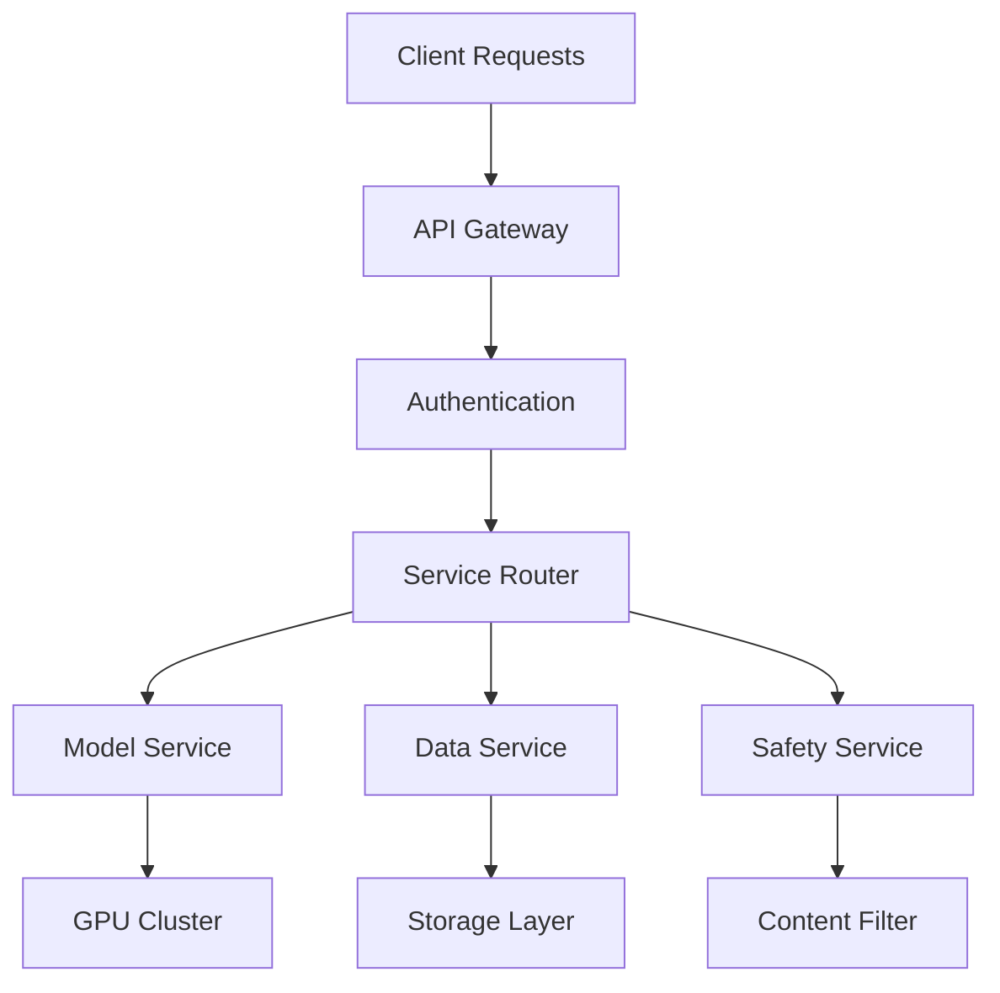

# Cosmos World Foundation Model Platform - Backend Service

## Overview

The Cosmos World Foundation Model (WFM) Platform backend service is a comprehensive synthetic data generation system designed to accelerate the development of Physical AI applications. This service provides the core infrastructure for pre-trained foundation models, efficient tokenizers, and a robust data curation pipeline.

### Key Features
- Distributed microservices architecture optimized for large-scale video generation
- Support for both diffusion and autoregressive world foundation models
- Comprehensive safety guardrails with pre/post filtering
- Scalable data curation and processing pipeline
- Multi-environment deployment support (Cloud, Hybrid, On-Premises)
- Enterprise-grade security and monitoring

### Architecture Overview


## Prerequisites

### Software Requirements
- Node.js >= 18.0.0
- NPM >= 9.0.0
- Docker >= 24.0.0
- Docker Compose >= 2.20.0
- MongoDB >= 6.0

### Hardware Requirements
- NVIDIA GPU with CUDA 12.0+
- NVIDIA Driver >= 525.0
- Minimum 32GB RAM
- High-bandwidth network connection
- NVMe SSD storage recommended

## Getting Started

### Environment Setup
```bash
# Clone the repository
git clone https://github.com/cosmos/wfm-platform.git
cd wfm-platform/backend

# Install dependencies
npm install

# Copy and configure environment variables
cp .env.example .env
```

### Configuration
1. Configure environment variables in `.env`
2. Set up GPU access in Docker
3. Configure MongoDB connection
4. Set up cloud storage credentials
5. Configure security parameters

### Verification
```bash
# Verify GPU setup
nvidia-smi

# Verify development environment
npm run verify

# Run test suite
npm run test
```

## Development

### Project Structure
```
src/backend/
├── api/            # API endpoints and controllers
├── models/         # Model definitions and interfaces
├── services/       # Business logic implementation
├── config/         # Configuration files
├── utils/          # Utility functions
├── middleware/     # Custom middleware
├── tests/          # Test suites
└── scripts/        # Development and deployment scripts
```

### Available Scripts
```bash
# Development
npm run dev         # Start development server
npm run build       # Build production bundle
npm run test        # Run test suite
npm run lint        # Run linter
npm run format      # Format code

# Deployment
npm run deploy:staging
npm run deploy:prod
```

### Testing Guide
- Unit tests: `npm run test:unit`
- Integration tests: `npm run test:integration`
- Performance tests: `npm run test:perf`
- Coverage report: `npm run test:coverage`

## Deployment

### Cloud Deployment (AWS/GCP/Azure)
```bash
# Configure cloud credentials
aws configure  # For AWS
gcloud auth login  # For GCP
az login  # For Azure

# Deploy infrastructure
terraform init
terraform plan
terraform apply

# Deploy application
kubectl apply -f k8s/
```

### Environment Configuration
```yaml
# Production environment variables
NODE_ENV=production
LOG_LEVEL=info
GPU_MEMORY_FRACTION=0.9
MAX_BATCH_SIZE=32
ENABLE_SAFETY_FILTERS=true
```

### Monitoring Setup
- Prometheus for metrics collection
- Grafana for visualization
- ELK stack for log management
- Custom dashboards for model performance

## API Documentation

### Authentication
```typescript
// JWT Authentication
POST /api/v1/auth/login
{
  "apiKey": "your-api-key",
  "secret": "your-secret"
}
```

### Models API
```typescript
// List available models
GET /api/v1/models

// Generate content
POST /api/v1/generate
{
  "model": "diffusion-7b",
  "prompt": "scene description",
  "parameters": {
    "frames": 57,
    "resolution": "1280x720"
  }
}
```

### Safety API
```typescript
// Configure safety filters
POST /api/v1/safety/configure
{
  "preGuard": {
    "enabled": true,
    "sensitivity": "high"
  },
  "postGuard": {
    "enabled": true,
    "filters": ["content", "face-blur"]
  }
}
```

## Security

### Access Control
- Role-based access control (RBAC)
- API key authentication
- Request signing
- Rate limiting

### Data Protection
- TLS 1.3 encryption
- At-rest encryption
- Regular security audits
- Automated vulnerability scanning

## Support

### Troubleshooting
- Check GPU availability: `nvidia-smi`
- Verify MongoDB connection: `mongosh`
- Check logs: `docker-compose logs`
- Monitor resources: `htop`

### Common Issues
1. GPU not detected
2. Memory allocation errors
3. Database connection issues
4. Network timeout errors

## License
MIT License - see LICENSE file for details

## Contributors
- Development Team
- DevOps Team
- Security Team

---
Last Updated: 2024-01-20
Version: 1.0.0